# How to integrate your static website with DynamoDB (without using Lambda)

In this lab we will show you how you can communicate directly with a DynamoDB back-end from client-side script in your static hosted website.

## Audience

The audience for this lab are system and software engineers with basic knowledge of:

- **AWS**
- **JavaScript**
- [cURL](https://curl.haxx.se/ "cURL") or [https://www.getpostman.com/](https://www.getpostman.com/ "Postman") to test the API endpoints that you are about to create in API gateway

## Executive Summary

API gateway can directly communicate with AWS services using their low-level APIs. This includes AWS services such as DynamoDB and S3. In this lab we show how to directly communicate with DynamoDB through API Gateway without using any server-side logic such as Lambda.

## Prerequisites 

- an active AWS account with a role that has permissions to create endpoints in **API Gateway**.
- [cURL](https://curl.haxx.se/ "cURL") installed or [https://www.getpostman.com/](https://www.getpostman.com/ "Postman") opened.
- An existing AWS Service Proxy Execution Role with permissions to read objects from DynamoDB: [https://docs.aws.amazon.com/apigateway/latest/developerguide/getting-started-aws-proxy.html#getting-started-aws-proxy-add-roles](https://docs.aws.amazon.com/apigateway/latest/developerguide/getting-started-aws-proxy.html#getting-started-aws-proxy-add-roles)

## Technical Concepts

### API-first development

**API-first development** is a strategy in which the first order of business is to develop an API that puts your target developer’s interests first and then build the product on top of it (be it a website, mobile application, or a SaaS software). 

By building on top of APIs with developers in mind, you and your developers are saving a lot of work while laying down the foundations for others to build on.

### Static website hosting

The trend of hosting **static websites** in the cloud is a becoming very popular. This approach has been adopted by many organizations due to its advantages over traditional server-based hosting. Static websites are websites that do not require any runtime environment like JRE, .NET, etc. and are mostly based on HTML, CSS, JS, and other static resources (audio/video files, documents, etc.) and using asynchronous HTTP calls to communicate with a back-end API. 
  
You *can* host a static website on **Amazon S3**. On a static website, individual webpages include static content. They might also contain client-side scripts. By contrast, a dynamic website relies on server-side processing, including server-side scripts such as PHP, JSP, or ASP.NET. Amazon S3 does not support server-side scripting. With static web-hosting it is relatively easy to port your application to mobile form factors using the same code base. 

However, **since S3 bucket URLs are non-SSL** (in other words: ``http://`` instead of ``https://``) and intended for internet-facing applications, they are **not suitable** to be used **for hosting private enterprise applications**. Even with the integration with a **CloudFront** instance, which would allow associating a SSL certificate to the S3 bucket, the application would still be publicly facing the internet. Therefore, it is our recommendation to **avoid S3 static website hosting** for internal facing enterprise applications and opt for the hosting of a **static website using AWS Elastic Beanstalk** as described in this lab.

### Securing your static hosted website

It is important to realize that in a static hosted API-first architecture all UI script is running in the browser and our true **first line of defense is the server-side API**. Since we are building a static hosted website with an API-first development strategy, your client-side script effectively becomes "open source" and all API-calls should require an access token. This is different from, for example a .NET application, where your UI logic partly runs on the server. 

**Note:** technically we could use an access token to secure all but a single landing page in our static web application. I will go into more depth on this in a later lab.

## Step 1. Create a table in DynamoDB

First, let's create a dummy table in DynamoDB from which we will retrieve some data later on in this lab.

Navigate to the DynamoDB console [https://console.aws.amazon.com/dynamodb/home](https://console.aws.amazon.com/dynamodb/home) in the region of your choice, for instance ``us-west-2``.

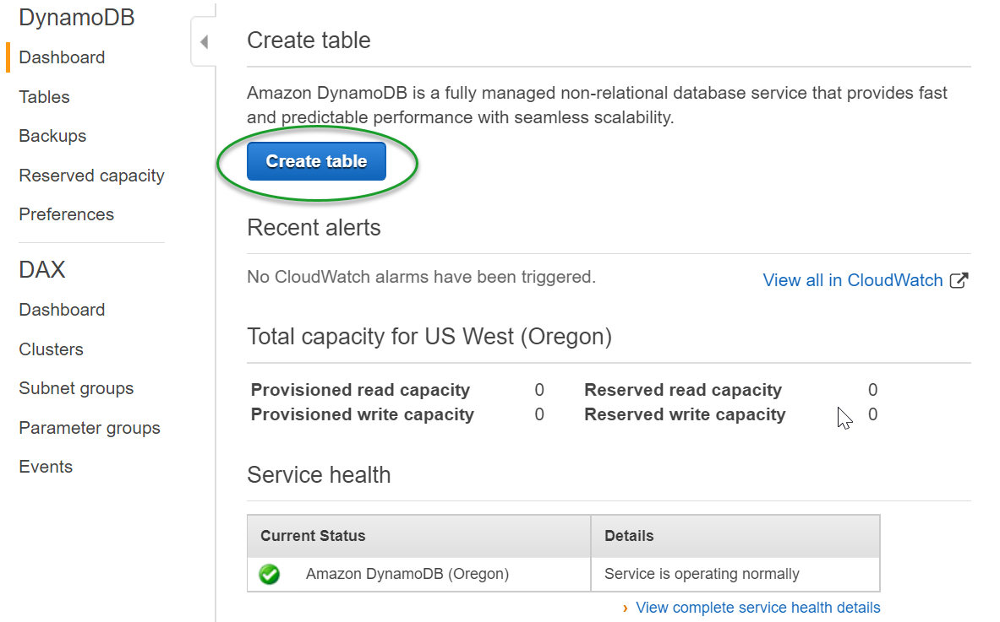

Then, click **Create Table**

Then, provide a **Table name**, such as ``StaticHostingSample`` and enter ``Id`` as **Primary Key** for your DynamoDB table:

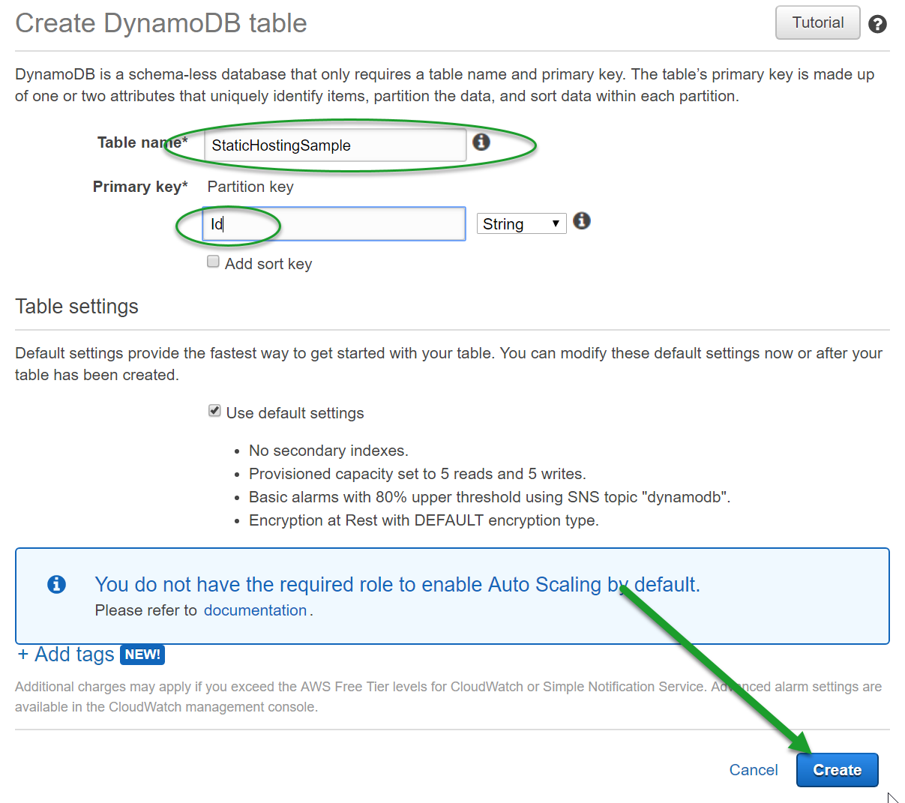

Then, your DynamoDB table will be created:

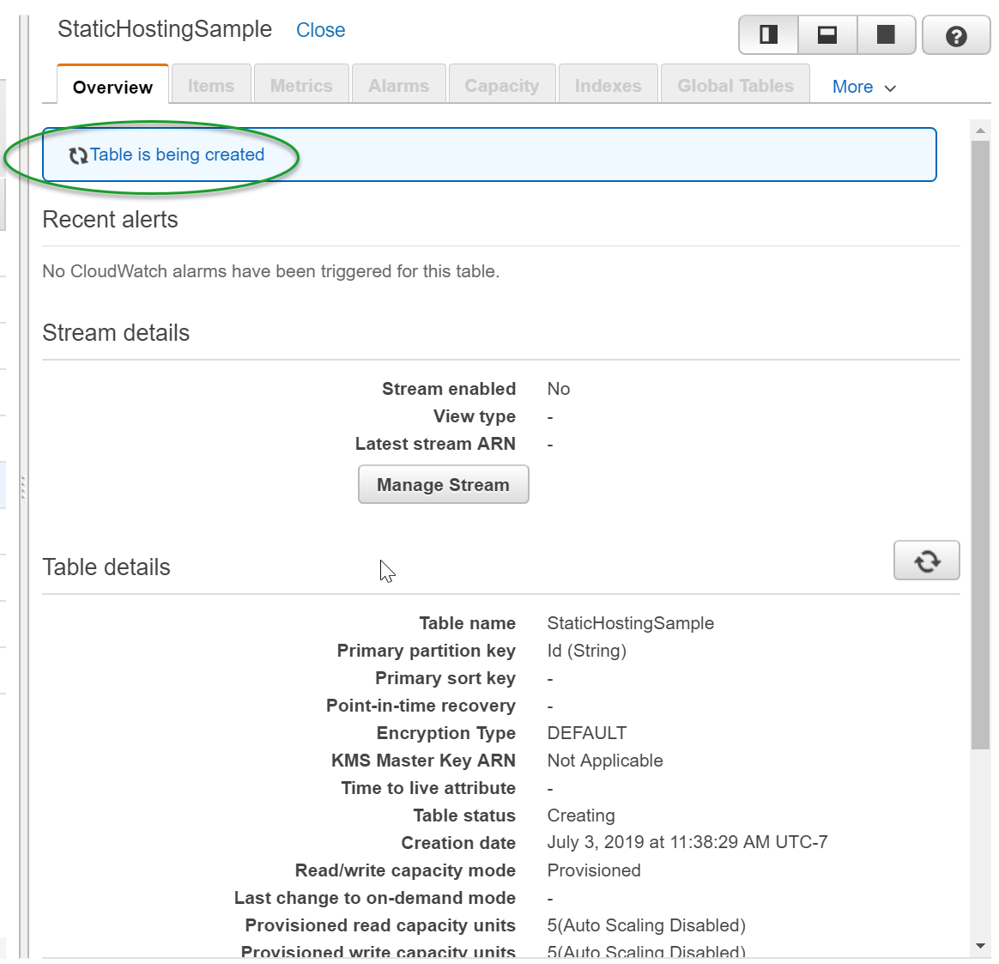

## Step 2. Create item in a DynamoDB table

Then, after your table is created, click on **Items**:

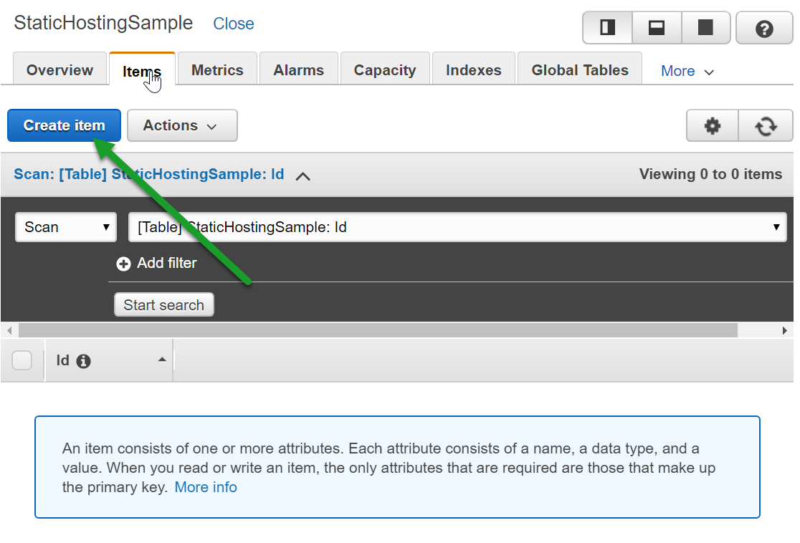

Then, click **Create Item**. A popup will appear where you can provide data to add to the DynamoDB table:

Now, select **Text** from the drop down list to be able to add a JSON document to the DynamoDB table:

Then, paste the following dummy JSON document generated with [https://www.json-generator.com/](https://www.json-generator.com/) into the text editor and click **Save**:
		
  {
    "Id": "5d1cf7f9c8a7237ccecbaf55",
    "Name": "Leblanc Mckee"
  }

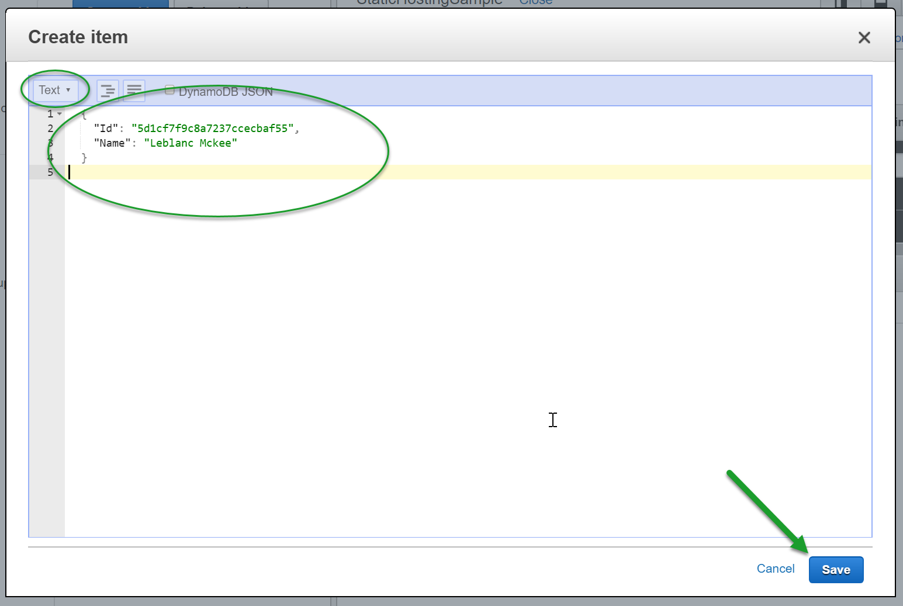

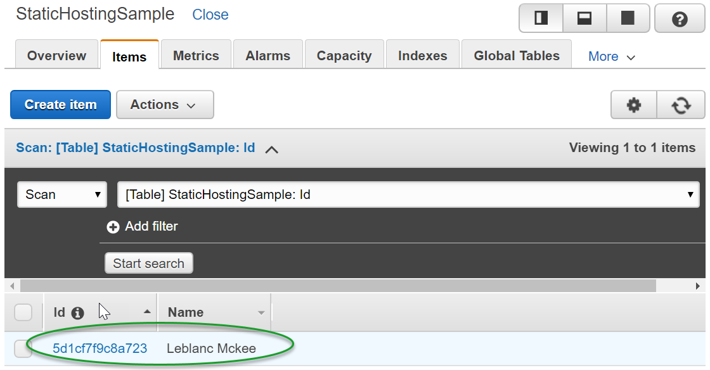

Now, we have a dummy record in our DynamoDB table. Let's go ahead and create an API in API Gateway that retrieves data from this DynamoDB table.

## Step 2. Create an API in API Gateway 

First, navigate to the API Gateway console [https://console.aws.amazon.com/apigateway/home](https://console.aws.amazon.com/apigateway/home) in the region of your choice, for instance ``us-west-2``.

Then, click **Create API**

Make sure **REST** and **New API** are selected. Then, enter a name as **API name**, for instance ``StaticHostingSample``, and a **Description**.

Make sure **Endpoint Type** is set to **Regional** as well. 

Then, click **Create API**   

Next, you will see an empty API:

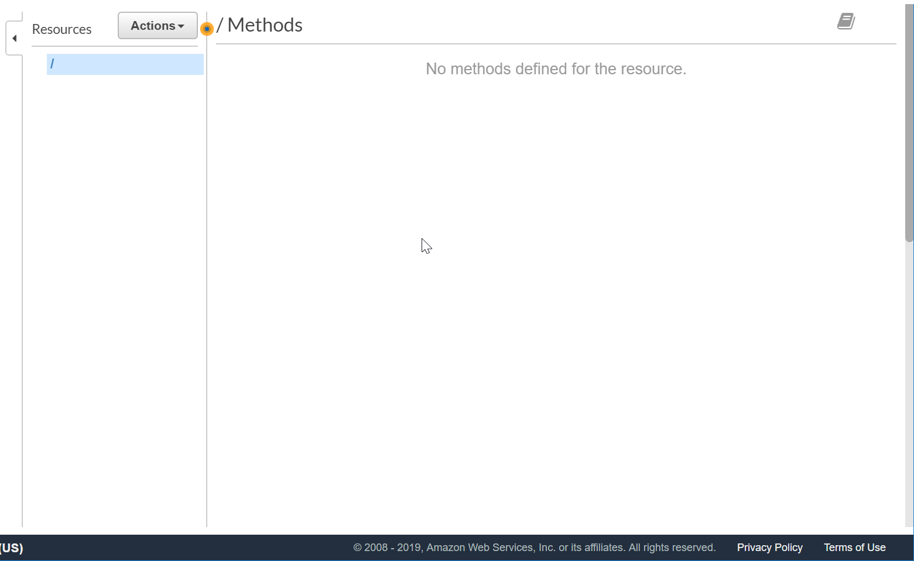

### Step 3. Create a Resource in API Gateway

Then, click **Create Resource** in the **Actions** drop down list 

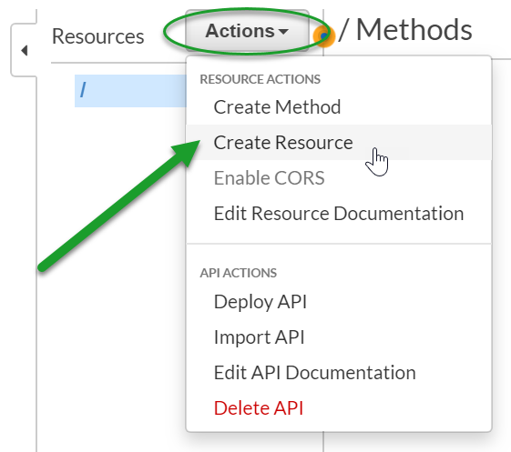

Then, entered ``getDatabaseItem`` as **Resource Name** and make sure you check the checkbox next to **Enable API Gateway CORS** and click **Create Resource**.

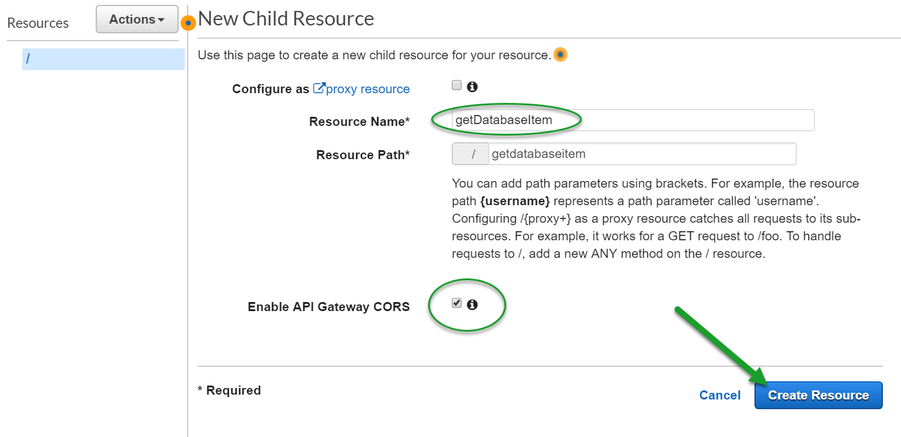

Now you have an empty ``/getDatabaseItem`` resource in your API:

Now, let's add a **Method** such as ``GET``:

### Step 4. Create a Method in API Gateway

Make sure you select ``/getdatabaseitem`` if it wasn't already selected and click **Create Method**:

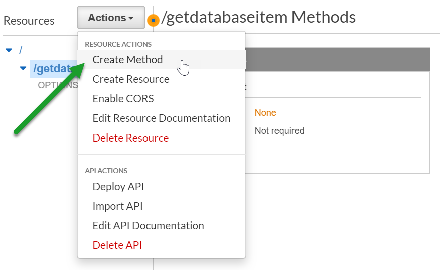

Then, a small drop down list will appear. Select **GET** from the drop down list:

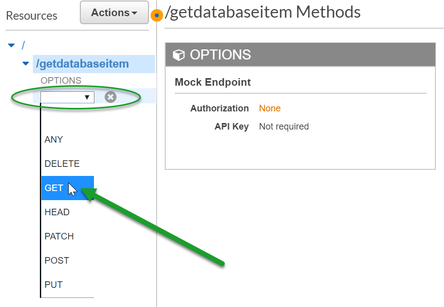

Then, click the small check icon to confirm the creation of the ``GET`` method:

Now, you will land on a page where you can set up the ``GET`` method.

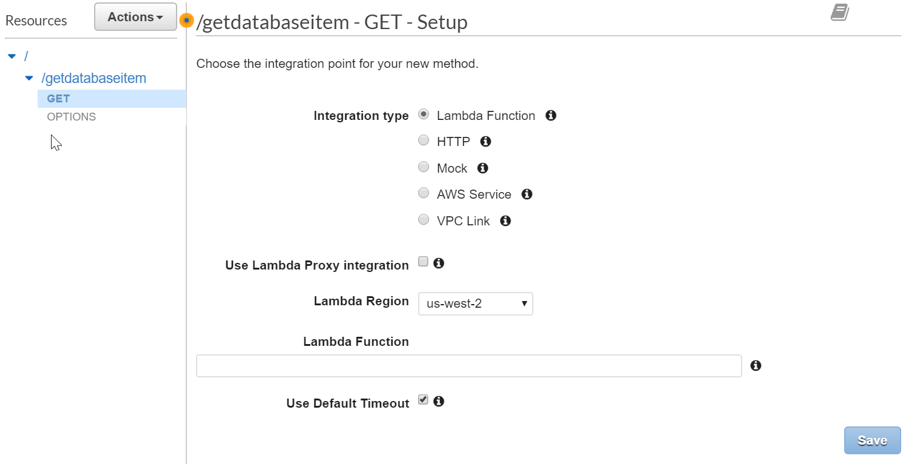

### Step 5. Setup Method in API Gateway

Then, select **AWS Service**.

Then, select the desired region from the **Region** drop down list, such as ``us-west-2``.

Select **DynamoDB** from the **AWS Service** drop down list.

Select ``POST`` from the **HTTP method** drop down list.

Make sure **Use action name** is selected as **Action Type**.

Then as **Action** type ``Scan``. This is the low level DynamoDB API endpoint to retrieve all items from a DynamoDB table.

Then as **Execution Role** use ``arn:aws:iam::359158632008:role/APIGatewayAWSProxyExecRole``. This is an Execution Role that has been provided by us for low-level API access to DynamoDB and S3 from API Gateway.

Make sure **Passthrough** is selected from the **Content Handling** drop down list.

Finally, click **Save**

### Step 6. Configure Integration Request

Then, click **Integration Request**

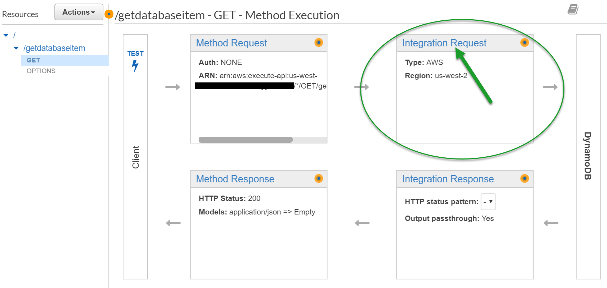

Then, scroll all the way down to **Mapping Templates** and then click **Add mapping template**:

Then, enter ``application/json`` as **Content-Type** and click the little check icon to the right of it.

Now, a popup may appear warning you about the consequences of passthrough behavior:

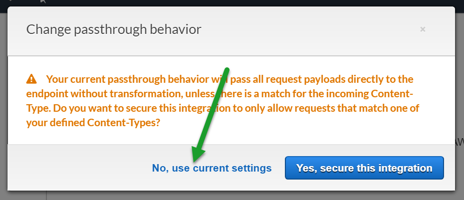

For now, let's go ahead and click **No, use current settings**.

Then, a text box appears at the bottom of the page. 

Now, go ahead and copy and page the following JSON document into the text box:

	{ 
	    "TableName": "StaticHostingSample"
	}

Then, click **Save**.

Then, click the back button next to **Method Execution** at the top of the page.

### Step 7. Test Method in API Gateway

Now, click **Test** at the top left of the diagram.

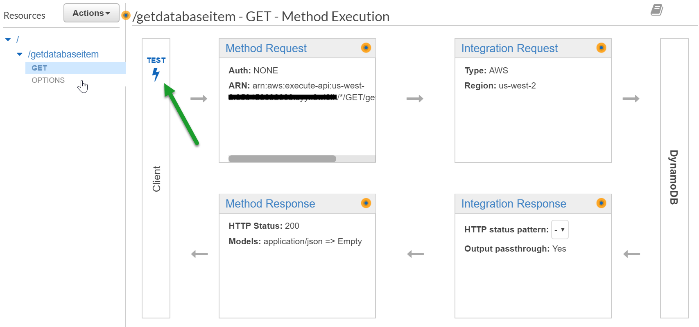

And there we have it, our dummy JSON document returned by API Gateway

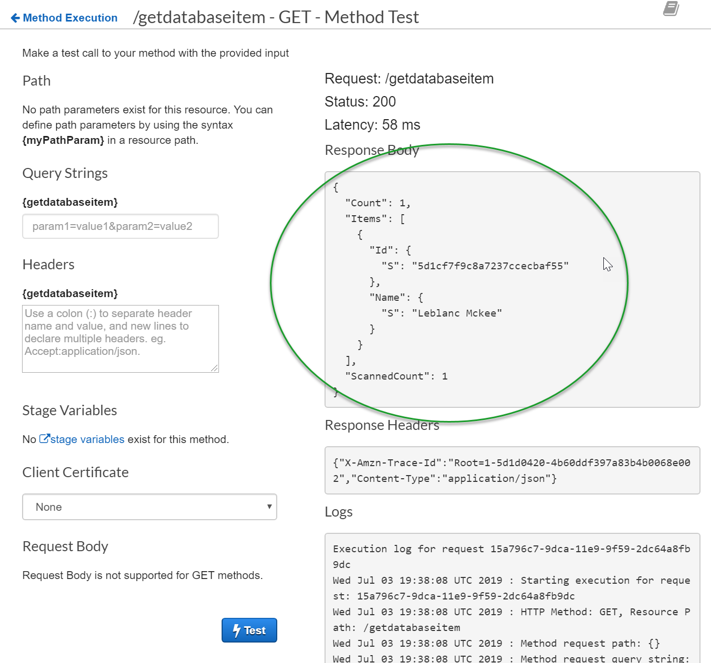

### Step 8. Deploy your Method in API Gateway

Now, let's deploy the API. But first, we need to **enable CORS**. 

**Important:** Even though we did this before a bug in the API Gateway console forces us to enable CORS before every deployment of our API.

Select the **GET** Resource and then click **Enable CORS**:

Then, click **Enable CORS and replace existing CORS headers**.

then, another popup will appear. Go ahead and click **Yes, replace existing values**.

Now, we are ready to actually deploy the API.

Make sure you select the ``GET`` resource at the left, and the select **Deploy API** from the **Actions** drop down list:

If you haven't deployed this API before select **New Stage** from the **Deployment Stage** drop down list. Otherwise select ``DEV`` from the **Deployment Stage** drop down list.

When creating a new stage, enter ``DEV`` as your **Stage name** and provide a description for **Stage description**:

Then, click **Deploy**.

Then, at the top of our **DEV Stage Editor** page we can find our endpoint URL which we can use in our client.

Take note of the endpoint base URL at the top, for instance:

	https://sbs594dei.execute-api.us-west-2.amazonaws.com/DEV

This means our endpoint URL is going to be

	https://sbs594dei.execute-api.us-west-2.amazonaws.com/DEV/getdatabaseitem

### Step 9. Test API with cURL or Postman

Now open a CMD or bash window in type the following command:

	curl https://sbs594dei.execute-api.us-west-2.amazonaws.com/DEV/getdatabaseitem

This should result in an output like this:

	{"Count":1,"Items":[{"Id":{"S":"5d1cf7f9c8a7237ccecbaf55"},"Name":{"S":"Leblanc Mckee"}}],"ScannedCount":1}

### Step 10. Secure your API endpoint

Up to this point your API isn't secured and anyone that knows the URL can see your data.

Now, assuming you have set up a Cognito User pool for your application and organization before, go ahead a click **Authorizers** from the left menu.

Then, click **Create New Authorizer**.

 

 

Then, provide a **Name** for the Authorizer, such as ``StaticHostingSampleAuthorizer``.

Then, select **Cognito** as **Type**.

Then, enter the name of your **Cognito User Pool**. Make sure you select the correct region if your Cognito User Pool is hosted in another region from your API Gateway. 

**Note:** if the **Cognito User Pool** drop down list does not populate, make sure you created a **Cognito User Pool**.

Then, enter ``Authorization`` as **Token Source**. 

Then, click **Create**.

Now, let's go back to the API, by clicking **Resources** from the left menu, and select the ``GET`` Resource.

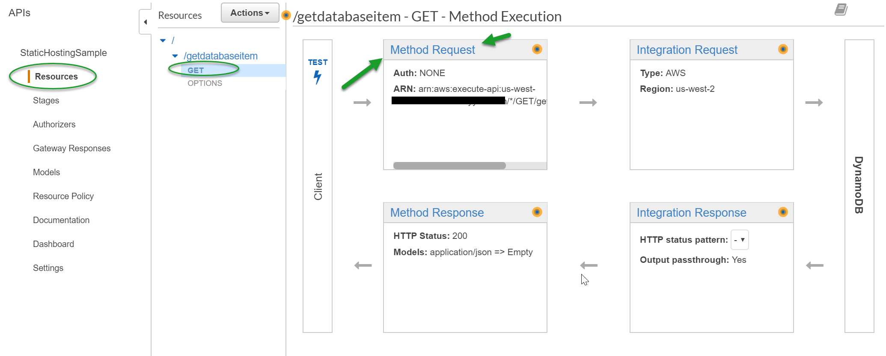

Then, click **Method Request**.

And, select **StaticHostingSampleAuthorizer** from the **Authorization** drop down list. Then click the little check icon. 

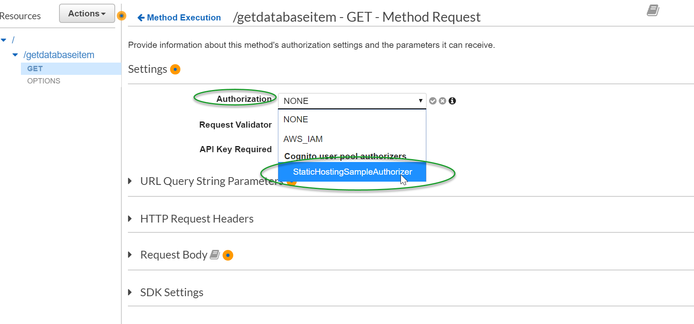

Now, re-deploy your API:

**Important:** Even though we did this before a bug in the API Gateway console forces us to enable CORS before every deployment of our API.

Select the **GET** Resource and then click **Enable CORS**:

Then, click **Enable CORS and replace existing CORS headers**.

then, another popup will appear. Go ahead and click **Yes, replace existing values**.

Now, we are ready to actually deploy the API.

Make sure you select the ``GET`` resource at the left, and the select **Deploy API** from the **Actions** drop down list:

If you haven't deployed this API before select **New Stage** from the **Deployment Stage** drop down list. Otherwise select ``DEV`` from the **Deployment Stage** drop down list.

When creating a new stage, enter ``DEV`` as your **Stage name** and provide a description for **Stage description**:

Then, click **Deploy**.

At this point, the cURL command or Postman call you executed earlier should fail because of a missing Authorization token:

	curl https://sbs594dei.execute-api.us-west-2.amazonaws.com/DEV/getdatabaseitem

	{"message":"Unauthorized"}

From now on, after integrating your web application with Cognito you will need to include a Cognito Authorization Token when calling your ``/getdatabaseitem`` API endpoint.

## Conclusion

In this lab we showed you how you can communicate directly to DynamoDB from client-side script in a static hosted website, without the use of Lambda.

## Contributors ##

| Roles											 | Author(s)										 |
| ---------------------------------------------- | ------------------------------------------------- |
| Lab Manuals									 | Manfred Wittenbols @mwittenbols					 |

## Version history ##

| Version | Date          		| Comments        |
| ------- | ------------------- | --------------- |
| 1.0     | June 28th, 2019   | Initial release |

## Disclaimer ##
**THIS CODE IS PROVIDED *AS IS* WITHOUT WARRANTY OF ANY KIND, EITHER EXPRESS OR IMPLIED, INCLUDING ANY IMPLIED WARRANTIES OF FITNESS FOR A PARTICULAR PURPOSE, MERCHANTABILITY, OR NON-INFRINGEMENT.**

